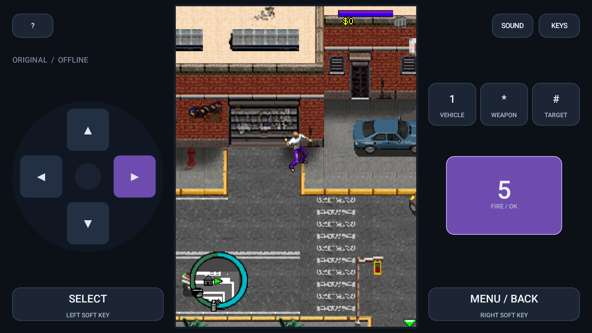

# Release verification · Android 10 and higher

Release: **1.0.0 (1)** · application ID: `net.san.gtamod.offline`

Successful CI run: https://github.com/sami3463367/SAN/actions/runs/34242193137

Built source: `1c8e5c8b00f7df6eabacc444d7083b88efee2265`.
The game code and wrapper are identical between debug and release compilation;
release disables debuggability and uses the new upload certificate. Instrumentation
ran against the debug variant. Release packaging/signatures were checked separately.

## Results

| Check | Result | Evidence |
|---|---|---|
| JVM record-store tests | 4 passed | `deliverables/unit-results/TEST-net.san.offline.RecordFilesTest.xml` |
| JVM pointer/key ownership tests | 3 passed | `deliverables/unit-results/TEST-net.san.offline.TouchKeysTest.xml` |
| Android 10 / API 29 instrumentation | 2 passed, 0 failed | `deliverables/android10-results/` |
| Android 16 / API 36 instrumentation | 2 passed, 0 failed | `deliverables/android16-results/` |
| APK signing | Verified, RSA 3072 / APK v2 | `deliverables/apk-signature.txt` |
| AAB signing | JarFile verification succeeded; warnings retained | `deliverables/aab-signature.txt` |
| Bundle structure | bundletool 1.18.3 validation passed | `deliverables/bundle-validation.txt` |
| APK original assets | All 54 byte-identical | `deliverables/release-apk-verification.json` |
| AAB original assets | All 54 byte-identical | `deliverables/release-aab-verification.json` |
| Final manifest | Minimum 29, target 36, no maximum SDK, not debuggable | `deliverables/release-manifest.xml` |
| Offline permission check | Only VIBRATE; no INTERNET | Same final manifest |
| Native libraries | None | Package verification reports |
| Private signing backup | Decrypted; matching public certificate; ignored by Git | Local recovery script check |

## Instrumented behavior

- Language selection, sound prompt, original menu and character creation.
- Original city gameplay and opening dialogue; no rewritten mission logic.
- Simulated native MotionEvents with distinct valid pointer IDs.
- Direction and fire held at once; releasing one finger does not release the other.
- ACTION_CANCEL releases direction; pointer/key reference counts are unit-tested.
- Landscape dimensions and exact 3:4 gameplay viewport ratio.
- Original local save serializer writes the app-private record store.
- Real Android MIDI/AMR player construction, preparation, start/stop and release.
- Going Home pauses the original loop; a foreground launcher action resumes it.
- All eight sprite transforms; clipping replacement and translation.
- Airplane-mode setting enabled and Wi-Fi disabled on both test emulators.

The failed intermediate tests are not concealed: the first touch assertion was
made while the original dialogue handler cleared held keys, and the initial
resume test attempted a background self-launch. The final tests reach unobstructed
gameplay and reopen via a foreground launcher action. They retain the simultaneous
key, independent-release and lifecycle assertions; these assertions now pass.

## Screenshots

Actual emulator captures, not mockups:

Other language/menu/gameplay/pause/resume captures are under
`deliverables/evidence/android10/` and `deliverables/evidence/android16/`.

## Boundaries

- **Not** a full playthrough of every mission, language, vehicle or minigame.
- **Not** physical-phone testing or proof of compatibility with every vendor ROM.
- Intermediate Android releases and newer versions have not each been tested;
  min SDK 29 and no maximum SDK allow Android 10 and higher to install.
- Original assets are exact bytes; Android MIDI synthesis and primitive edge
  rasterization can differ from a legacy handset. No blanket pixel-perfect claim.
- Original checkpoint semantics remain; backgrounding does not create a full
  emulator save-state. Uninstalling/clearing data removes local progress.
- The supplied mod has GTA branding but Saints Row 2 gameplay/story/credits.
- Store listing, licensing verification, rating, privacy disclosures, account
  testing requirements and physical-device QA remain publishing tasks.
- The AAB's standard AGP entry ordering produces JarInputStream-order warnings in
  current JDK jarsigner despite successful JarFile verification; the complete
  output is retained. Bundletool accepts the bundle. Play approval is not promised.

## SHA-256

APK: `b91f6325164f0f41cb2f2655bf3ce55a88c19b3f16ad2c87d361888693df87dc`

AAB: `f790b8527ea8b87ac6de22184135a05a6e6de2bf55593045a376a5aac6574aeb`

Public signing certificate:
`23ae1a3126729c7c847304e79fb714ba23f6d26fff6b49a08eec6a9095df7ca0`.
